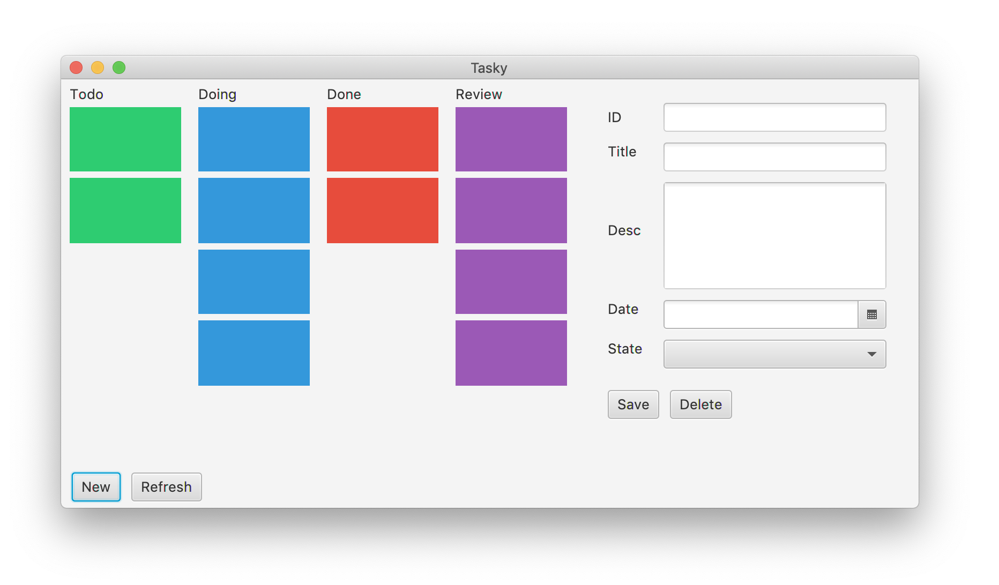
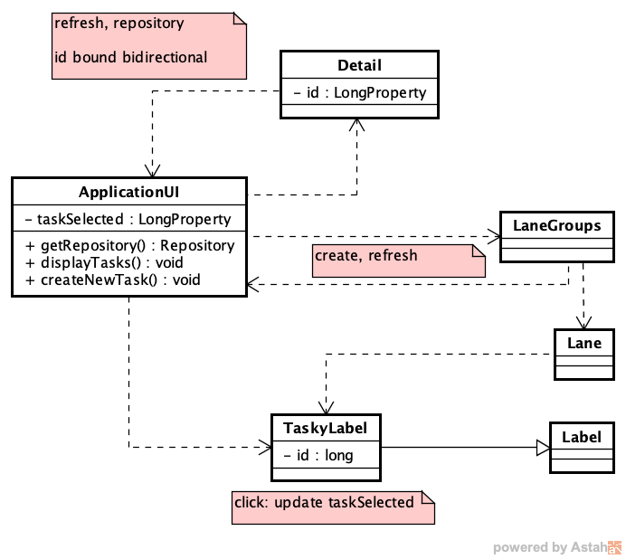

# Übung 7 – Tasky Part 5

In der Übung 6 (Tasky Part 4) haben wir das GUI mit allen erforderlichen Controls erstellt (siehe nachfolgender Screenshot. In dieser Übung werden wir die Controls mit den Klassen verbinden, welche die tatsächliche Funktionalität implementieren (z.B. Repository).

Noch eine Bemerkung zur Funktion des "New" Buttons. Wenn der New-Button gedrückt wird, erscheint in der ersten Lane (hier Todo) zuoberst eine neue Task. Zugleich wird auf dem Detail-Bildschirm die neue ID eingesetzt. Alle anderen Controls sind leer. Jetzt können die Daten der neuen Task erfasst werden. Mit "Save" werden die Daten gespeichert und der Titel in den neuen Task angezeigt.

## Tipps:

1. Schreiben Sie eine Klasse, **TaskyLabel** welche von Label abgeleitet ist. Diese Klasse implementiert ein Tasky Label und enthält die ID einer Task.

2. Überlegen Sie sich welche GUI Teile müssen mit einander synchronisiert werden müssen. Diese könnten mit Properties abgeglichen werden.

3.	Überlegen Sie sich welches Attribut als Property in Frage kommen könnte. Im Idealfall genügt ein Attribut! Müssen die Properties uni- oder bidirektional verbunden werden?

4.	Installieren Sie einen Click-Handler in der Klasse **TaskyLabel**. Dieser Handler setzt auf dem Property der Klasse MainScreen die ID dieser Task.

5.	Versuchen Sie so wenig wie möglich zu synchronisieren. Die Lanes/LaneGroup können z.B. nach jedem Update (Speichern, Löschen) neu gezeichnet werden.

Sie **können** (Sie müssen nicht!) sich für die Implementierung am folgenden Klassendiagramm orientieren. Es gibt viele Lösungen für die Umsetzung von Tasky. Diese Skizze ist eine mögliche Lösung.

